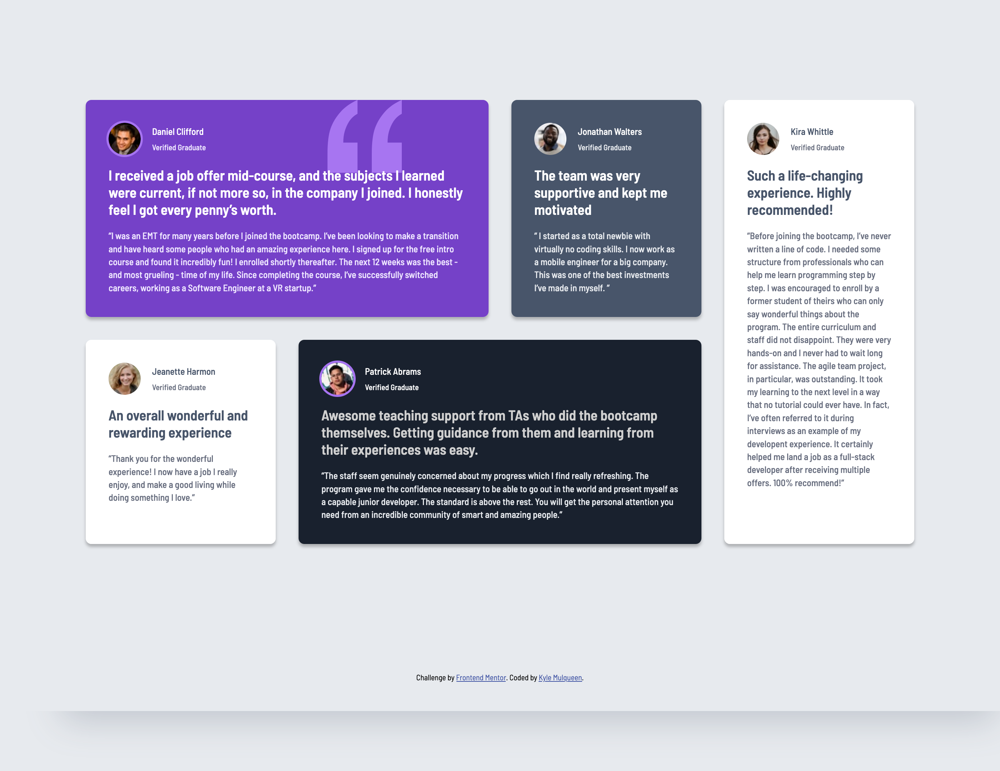
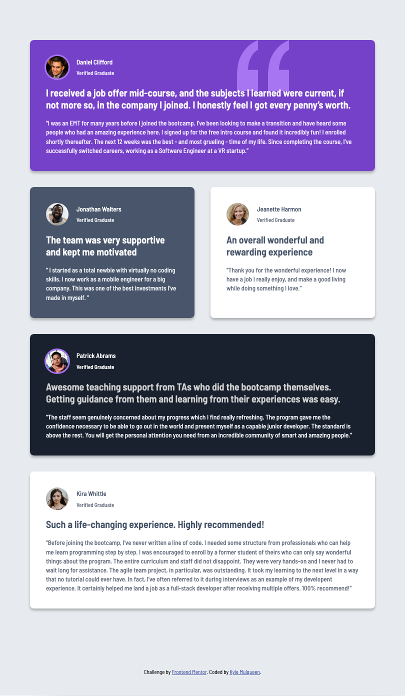

# Frontend Mentor - Testimonials grid section solution

This is a solution to the [Testimonials grid section challenge on Frontend Mentor](https://www.frontendmentor.io/challenges/testimonials-grid-section-Nnw6J7Un7). Frontend Mentor challenges help you improve your coding skills by building realistic projects.

## Table of contents

- [Frontend Mentor - Testimonials grid section solution](#frontend-mentor---testimonials-grid-section-solution)
  - [Table of contents](#table-of-contents)
  - [Overview](#overview)
    - [The challenge](#the-challenge)
    - [Screenshot](#screenshot)
    - [Links](#links)
  - [My process](#my-process)
    - [Built with](#built-with)
    - [What I learned](#what-i-learned)
    - [Continued development](#continued-development)
    - [Useful resources](#useful-resources)
  - [Author](#author)

## Overview

### The challenge

Users should be able to:

- View the optimal layout for the site depending on their device's screen size

### Screenshot

### Links

- Solution URL: [GitHub Pages](https://kmulqueen.github.io/testimonials-grid-section-challenge/)

## My process

### Built with

- Semantic HTML5 markup
- CSS custom properties
- CSS Grid
- Mobile-first workflow

### What I learned

During this project, I deepened my understanding of CSS Grid for creating complex layouts. I learned how to effectively use grid template areas to create visually appealing designs. I also gained experience with using SVG images as decorative elements via CSS background images and proper z-indexing to ensure text content remains readable when overlapping with design elements.

### Continued development

I would like to further explore responsive layouts using CSS Grid with minimal media queries. Something that bugged me this project was using the `nth-child` selector. I used that because I didn't want to add any unnecessary classes or ids to elements. However, I don't think this approach is great because it doesn't account for any testimonials that would be added in the future.

For upcoming projects, I plan to:

- Explore more maintainable alternatives to `nth-child` selectors for grid items
- Implement a component-based approach to improve scalability
- Refine techniques for positioning decorative elements without affecting content accessibility
- Practice creating fully fluid designs that require fewer breakpoints

### Useful resources

- [MDN Docs](https://developer.mozilla.org/en-US/docs/Web/CSS/:nth-child) - This helped me for targeting specific grid items. I didn't really like this approach but I couldn't think of another way without adding more specific selectors like classes and ids.
- [CSS Grid Course (no longer available :( ))](https://www.udemy.com/user/darylduckmanton/) - This is an amazing Udemy course on CSS Grid by Daryl Duckmanton. It seems to have been archived, but I have access from when I enrolled years ago. This was great to understand grid areas and the `grid` property.
- [CSS-Tricks Guide to CSS Grid](https://css-tricks.com/snippets/css/complete-guide-grid/) - A comprehensive reference that helped me visualize grid concepts and implement them correctly.

## Author

- Website - [Kyle Mulqueen](https://kmulqueen.github.io/portfolio-2025/)
- Frontend Mentor - [@kmulqueen](https://www.frontendmentor.io/profile/kmulqueen)
